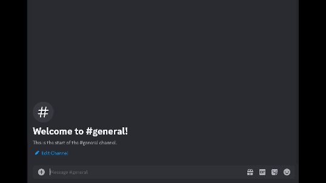

# Discord Bot Made with Golang

## Project Description

This is a small project that involves a Discord bot integrated with a locally running orca-mini -3B LLM using Ollama. The bot accepts responses via a built-in REST API.

## Prerequisites

- Go 1.21 or later
- Git
- Ollama

## Installation

1. **Download Go 1.21**: You can download it from the official [Go website](https://go.dev/doc/install).

2. **Clone the project**: Use the command `git clone https://github.com/unsuman/discord-bot.git` to clone the project.
3. **Download and set up Ollama**: Follow the instructions on the Ollama website to download and set up [Ollama](https://ollama.com/download).

## Configuration

1. **Run the script**: To run the script simply run `chmod +x script.sh` and then `./script.sh`.

2. **Edit the config.json file**: Open the `config.json` file in a text editor and replace the placeholder Discord token with your own Discord token.

3. **Invite the bot to your server**: Use the Discord Developer Portal's OAuth2 URL generator to invite the bot to your server.

## Running the Bot Locally

After you've completed the installation and configuration steps, you can run the bot locally using the command `go run main.go`.
